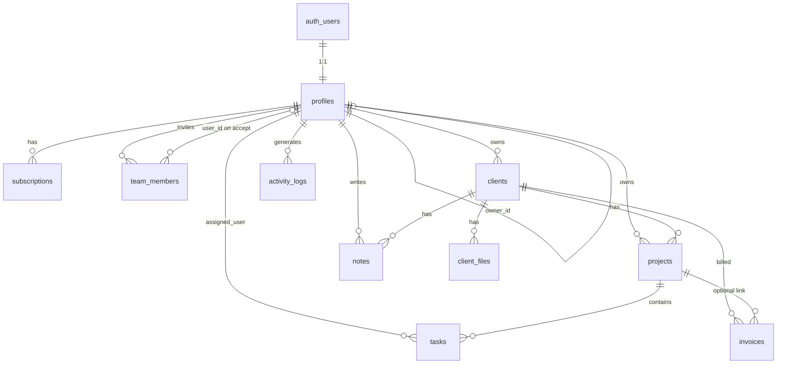

# DB — Database Schema

## Studioflow — Agency CRM

| Meta | Value |
|------|-------|
| **Document** | Database Schema (v1.0) |
| **Date** | June 18, 2026 |
| **Engine** | PostgreSQL 15+ (Supabase) |
| **Related** | [PRD.md](./PRD.md) · [Tech.md](./Tech.md) |

---

## 1. Overview

The Studioflow database is hosted on **Supabase PostgreSQL** with **Row Level Security (RLS)** enabled on all application tables. Data is scoped by **workspace owner** — each Owner account owns a workspace; invited team members access the same data through RLS helper functions.

### Design Principles

- `profiles.id` = `auth.users.id` (1:1 with Supabase Auth)
- Tenant-scoped tables use `user_id` referencing the **workspace owner**
- Team members link via `profiles.owner_id` → owner's UUID
- All mutations validated by RLS; RBAC enforced in application layer
- Activity logs written from Server Actions (not DB triggers)
- Currency stored as `NUMERIC(12, 2)` in USD

---

## 2. Entity Relationship Diagram



---

## 3. Custom Types (Enums)

```sql
-- User & subscription
CREATE TYPE public.user_role AS ENUM ('Owner', 'Manager', 'Member');
CREATE TYPE public.plan_type AS ENUM ('Free', 'Pro', 'Agency');
CREATE TYPE public.subscription_status AS ENUM ('Active', 'Cancelled');

-- CRM entities
CREATE TYPE public.client_status AS ENUM ('Lead', 'Active', 'Inactive');
CREATE TYPE public.project_status AS ENUM ('Planning', 'In Progress', 'Review', 'Completed');
CREATE TYPE public.task_priority AS ENUM ('Low', 'Medium', 'High');
CREATE TYPE public.task_status AS ENUM ('Todo', 'Doing', 'Done');
CREATE TYPE public.invoice_status AS ENUM ('Pending', 'Paid', 'Overdue');
```

---

## 4. Tables

### 4.1 `profiles`

Extends Supabase Auth users with application metadata.

| Column | Type | Constraints | Description |
|--------|------|-------------|-------------|
| `id` | `UUID` | PK, FK → `auth.users(id)` ON DELETE CASCADE | Auth user ID |
| `email` | `TEXT` | NOT NULL | User email (denormalized from auth) |
| `full_name` | `TEXT` | NULL | Display name |
| `avatar_url` | `TEXT` | NULL | Supabase Storage public URL |
| `role` | `user_role` | NOT NULL DEFAULT `'Owner'` | Application role |
| `owner_id` | `UUID` | NULL, FK → `profiles(id)` ON DELETE SET NULL | Workspace owner (NULL = is owner) |
| `created_at` | `TIMESTAMPTZ` | NOT NULL DEFAULT `now()` | Registration timestamp |

**Notes:**
- New registrants: `role = 'Owner'`, `owner_id = NULL`
- Invited team members: `role = 'Manager' | 'Member'`, `owner_id = <owner UUID>`

```sql
CREATE TABLE public.profiles (
  id          UUID PRIMARY KEY REFERENCES auth.users(id) ON DELETE CASCADE,
  email       TEXT NOT NULL,
  full_name   TEXT,
  avatar_url  TEXT,
  role        public.user_role NOT NULL DEFAULT 'Owner',
  owner_id    UUID REFERENCES public.profiles(id) ON DELETE SET NULL,
  created_at  TIMESTAMPTZ NOT NULL DEFAULT now(),

  CONSTRAINT profiles_owner_not_self CHECK (owner_id IS NULL OR owner_id <> id)
);

CREATE INDEX idx_profiles_owner_id ON public.profiles(owner_id);
CREATE INDEX idx_profiles_email ON public.profiles(email);
```

---

### 4.2 `subscriptions`

One active subscription per workspace owner.

| Column | Type | Constraints | Description |
|--------|------|-------------|-------------|
| `id` | `UUID` | PK DEFAULT `gen_random_uuid()` | Subscription ID |
| `user_id` | `UUID` | NOT NULL, FK → `profiles(id)` ON DELETE CASCADE | Workspace owner |
| `plan` | `plan_type` | NOT NULL DEFAULT `'Free'` | Current plan |
| `status` | `subscription_status` | NOT NULL DEFAULT `'Active'` | Subscription state |
| `created_at` | `TIMESTAMPTZ` | NOT NULL DEFAULT `now()` | Subscription start |

```sql
CREATE TABLE public.subscriptions (
  id          UUID PRIMARY KEY DEFAULT gen_random_uuid(),
  user_id     UUID NOT NULL REFERENCES public.profiles(id) ON DELETE CASCADE,
  plan        public.plan_type NOT NULL DEFAULT 'Free',
  status      public.subscription_status NOT NULL DEFAULT 'Active',
  created_at  TIMESTAMPTZ NOT NULL DEFAULT now()
);

CREATE INDEX idx_subscriptions_user_id ON public.subscriptions(user_id);
CREATE UNIQUE INDEX idx_subscriptions_active_user
  ON public.subscriptions(user_id)
  WHERE status = 'Active';
```

---

### 4.3 `clients`

| Column | Type | Constraints | Description |
|--------|------|-------------|-------------|
| `id` | `UUID` | PK DEFAULT `gen_random_uuid()` | Client ID |
| `user_id` | `UUID` | NOT NULL, FK → `profiles(id)` ON DELETE CASCADE | Workspace owner |
| `name` | `TEXT` | NOT NULL | Client name |
| `company` | `TEXT` | NULL | Company name |
| `email` | `TEXT` | NULL | Contact email |
| `phone` | `TEXT` | NULL | Contact phone |
| `status` | `client_status` | NOT NULL DEFAULT `'Lead'` | Client lifecycle status |
| `notes` | `TEXT` | NULL | Inline notes (short) |
| `created_at` | `TIMESTAMPTZ` | NOT NULL DEFAULT `now()` | Created timestamp |

```sql
CREATE TABLE public.clients (
  id          UUID PRIMARY KEY DEFAULT gen_random_uuid(),
  user_id     UUID NOT NULL REFERENCES public.profiles(id) ON DELETE CASCADE,
  name        TEXT NOT NULL,
  company     TEXT,
  email       TEXT,
  phone       TEXT,
  status      public.client_status NOT NULL DEFAULT 'Lead',
  notes       TEXT,
  created_at  TIMESTAMPTZ NOT NULL DEFAULT now()
);

CREATE INDEX idx_clients_user_id ON public.clients(user_id);
CREATE INDEX idx_clients_status ON public.clients(status);
CREATE INDEX idx_clients_name ON public.clients USING gin(to_tsvector('english', name));
```

---

### 4.4 `projects`

| Column | Type | Constraints | Description |
|--------|------|-------------|-------------|
| `id` | `UUID` | PK DEFAULT `gen_random_uuid()` | Project ID |
| `client_id` | `UUID` | NOT NULL, FK → `clients(id)` ON DELETE CASCADE | Parent client |
| `user_id` | `UUID` | NOT NULL, FK → `profiles(id)` ON DELETE CASCADE | Workspace owner |
| `name` | `TEXT` | NOT NULL | Project name |
| `description` | `TEXT` | NULL | Project description |
| `budget` | `NUMERIC(12, 2)` | NULL | Budget in USD |
| `deadline` | `DATE` | NULL | Due date |
| `status` | `project_status` | NOT NULL DEFAULT `'Planning'` | Kanban column |
| `created_at` | `TIMESTAMPTZ` | NOT NULL DEFAULT `now()` | Created timestamp |

```sql
CREATE TABLE public.projects (
  id           UUID PRIMARY KEY DEFAULT gen_random_uuid(),
  client_id    UUID NOT NULL REFERENCES public.clients(id) ON DELETE CASCADE,
  user_id      UUID NOT NULL REFERENCES public.profiles(id) ON DELETE CASCADE,
  name         TEXT NOT NULL,
  description  TEXT,
  budget       NUMERIC(12, 2),
  deadline     DATE,
  status       public.project_status NOT NULL DEFAULT 'Planning',
  created_at   TIMESTAMPTZ NOT NULL DEFAULT now()
);

CREATE INDEX idx_projects_user_id ON public.projects(user_id);
CREATE INDEX idx_projects_client_id ON public.projects(client_id);
CREATE INDEX idx_projects_status ON public.projects(status);
CREATE INDEX idx_projects_deadline ON public.projects(deadline);
```

---

### 4.5 `tasks`

| Column | Type | Constraints | Description |
|--------|------|-------------|-------------|
| `id` | `UUID` | PK DEFAULT `gen_random_uuid()` | Task ID |
| `project_id` | `UUID` | NOT NULL, FK → `projects(id)` ON DELETE CASCADE | Parent project |
| `assigned_user` | `UUID` | NULL, FK → `profiles(id)` ON DELETE SET NULL | Assignee |
| `title` | `TEXT` | NOT NULL | Task title |
| `description` | `TEXT` | NULL | Task details |
| `due_date` | `DATE` | NULL | Due date |
| `priority` | `task_priority` | NOT NULL DEFAULT `'Medium'` | Priority level |
| `status` | `task_status` | NOT NULL DEFAULT `'Todo'` | Task status |
| `created_at` | `TIMESTAMPTZ` | NOT NULL DEFAULT `now()` | Created timestamp |

```sql
CREATE TABLE public.tasks (
  id             UUID PRIMARY KEY DEFAULT gen_random_uuid(),
  project_id     UUID NOT NULL REFERENCES public.projects(id) ON DELETE CASCADE,
  assigned_user  UUID REFERENCES public.profiles(id) ON DELETE SET NULL,
  title          TEXT NOT NULL,
  description    TEXT,
  due_date       DATE,
  priority       public.task_priority NOT NULL DEFAULT 'Medium',
  status         public.task_status NOT NULL DEFAULT 'Todo',
  created_at     TIMESTAMPTZ NOT NULL DEFAULT now()
);

CREATE INDEX idx_tasks_project_id ON public.tasks(project_id);
CREATE INDEX idx_tasks_assigned_user ON public.tasks(assigned_user);
CREATE INDEX idx_tasks_status ON public.tasks(status);
CREATE INDEX idx_tasks_due_date ON public.tasks(due_date);
```

---

### 4.6 `invoices`

| Column | Type | Constraints | Description |
|--------|------|-------------|-------------|
| `id` | `UUID` | PK DEFAULT `gen_random_uuid()` | Invoice ID |
| `client_id` | `UUID` | NOT NULL, FK → `clients(id)` ON DELETE CASCADE | Billed client |
| `project_id` | `UUID` | NULL, FK → `projects(id)` ON DELETE SET NULL | Related project |
| `user_id` | `UUID` | NOT NULL, FK → `profiles(id)` ON DELETE CASCADE | Workspace owner |
| `invoice_number` | `TEXT` | NOT NULL | Human-readable number |
| `amount` | `NUMERIC(12, 2)` | NOT NULL CHECK (amount >= 0) | Amount in USD |
| `due_date` | `DATE` | NOT NULL | Payment due date |
| `status` | `invoice_status` | NOT NULL DEFAULT `'Pending'` | Payment status |
| `created_at` | `TIMESTAMPTZ` | NOT NULL DEFAULT `now()` | Created timestamp |

```sql
CREATE TABLE public.invoices (
  id              UUID PRIMARY KEY DEFAULT gen_random_uuid(),
  client_id       UUID NOT NULL REFERENCES public.clients(id) ON DELETE CASCADE,
  project_id      UUID REFERENCES public.projects(id) ON DELETE SET NULL,
  user_id         UUID NOT NULL REFERENCES public.profiles(id) ON DELETE CASCADE,
  invoice_number  TEXT NOT NULL,
  amount          NUMERIC(12, 2) NOT NULL CHECK (amount >= 0),
  due_date        DATE NOT NULL,
  status          public.invoice_status NOT NULL DEFAULT 'Pending',
  created_at      TIMESTAMPTZ NOT NULL DEFAULT now(),

  UNIQUE (user_id, invoice_number)
);

CREATE INDEX idx_invoices_user_id ON public.invoices(user_id);
CREATE INDEX idx_invoices_client_id ON public.invoices(client_id);
CREATE INDEX idx_invoices_status ON public.invoices(status);
CREATE INDEX idx_invoices_due_date ON public.invoices(due_date);
```

---

### 4.7 `notes`

| Column | Type | Constraints | Description |
|--------|------|-------------|-------------|
| `id` | `UUID` | PK DEFAULT `gen_random_uuid()` | Note ID |
| `client_id` | `UUID` | NOT NULL, FK → `clients(id)` ON DELETE CASCADE | Parent client |
| `user_id` | `UUID` | NOT NULL, FK → `profiles(id)` ON DELETE CASCADE | Author |
| `content` | `TEXT` | NOT NULL | Note body |
| `created_at` | `TIMESTAMPTZ` | NOT NULL DEFAULT `now()` | Created timestamp |

```sql
CREATE TABLE public.notes (
  id          UUID PRIMARY KEY DEFAULT gen_random_uuid(),
  client_id   UUID NOT NULL REFERENCES public.clients(id) ON DELETE CASCADE,
  user_id     UUID NOT NULL REFERENCES public.profiles(id) ON DELETE CASCADE,
  content     TEXT NOT NULL,
  created_at  TIMESTAMPTZ NOT NULL DEFAULT now()
);

CREATE INDEX idx_notes_client_id ON public.notes(client_id);
CREATE INDEX idx_notes_user_id ON public.notes(user_id);
```

---

### 4.8 `team_members`

| Column | Type | Constraints | Description |
|--------|------|-------------|-------------|
| `id` | `UUID` | PK DEFAULT `gen_random_uuid()` | Invitation ID |
| `owner_id` | `UUID` | NOT NULL, FK → `profiles(id)` ON DELETE CASCADE | Workspace owner |
| `user_id` | `UUID` | NULL, FK → `profiles(id)` ON DELETE SET NULL | Linked account after accept |
| `email` | `TEXT` | NOT NULL | Invitee email |
| `role` | `user_role` | NOT NULL DEFAULT `'Member'` | Assigned role (Manager/Member) |
| `created_at` | `TIMESTAMPTZ` | NOT NULL DEFAULT `now()` | Invitation timestamp |

**Notes:**
- `user_id` is `NULL` until invitee accepts and creates account
- `role` must be `'Manager'` or `'Member'` (not `'Owner'`)

```sql
CREATE TABLE public.team_members (
  id          UUID PRIMARY KEY DEFAULT gen_random_uuid(),
  owner_id    UUID NOT NULL REFERENCES public.profiles(id) ON DELETE CASCADE,
  user_id     UUID REFERENCES public.profiles(id) ON DELETE SET NULL,
  email       TEXT NOT NULL,
  role        public.user_role NOT NULL DEFAULT 'Member',
  created_at  TIMESTAMPTZ NOT NULL DEFAULT now(),

  CONSTRAINT team_members_role_check CHECK (role IN ('Manager', 'Member')),
  UNIQUE (owner_id, email)
);

CREATE INDEX idx_team_members_owner_id ON public.team_members(owner_id);
CREATE INDEX idx_team_members_user_id ON public.team_members(user_id);
CREATE INDEX idx_team_members_email ON public.team_members(email);
```

---

### 4.9 `client_files`

| Column | Type | Constraints | Description |
|--------|------|-------------|-------------|
| `id` | `UUID` | PK DEFAULT `gen_random_uuid()` | File record ID |
| `client_id` | `UUID` | NOT NULL, FK → `clients(id)` ON DELETE CASCADE | Parent client |
| `user_id` | `UUID` | NOT NULL, FK → `profiles(id)` ON DELETE CASCADE | Workspace owner |
| `file_name` | `TEXT` | NOT NULL | Original filename |
| `file_url` | `TEXT` | NOT NULL | Supabase Storage path/URL |
| `file_size` | `INTEGER` | NULL | Size in bytes |
| `mime_type` | `TEXT` | NULL | MIME type |
| `uploaded_at` | `TIMESTAMPTZ` | NOT NULL DEFAULT `now()` | Upload timestamp |

```sql
CREATE TABLE public.client_files (
  id           UUID PRIMARY KEY DEFAULT gen_random_uuid(),
  client_id    UUID NOT NULL REFERENCES public.clients(id) ON DELETE CASCADE,
  user_id      UUID NOT NULL REFERENCES public.profiles(id) ON DELETE CASCADE,
  file_name    TEXT NOT NULL,
  file_url     TEXT NOT NULL,
  file_size    INTEGER,
  mime_type    TEXT,
  uploaded_at  TIMESTAMPTZ NOT NULL DEFAULT now()
);

CREATE INDEX idx_client_files_client_id ON public.client_files(client_id);
CREATE INDEX idx_client_files_user_id ON public.client_files(user_id);
```

---

### 4.10 `activity_logs`

| Column | Type | Constraints | Description |
|--------|------|-------------|-------------|
| `id` | `UUID` | PK DEFAULT `gen_random_uuid()` | Log ID |
| `user_id` | `UUID` | NOT NULL, FK → `profiles(id)` ON DELETE CASCADE | Actor (who performed action) |
| `workspace_id` | `UUID` | NOT NULL, FK → `profiles(id)` ON DELETE CASCADE | Workspace owner scope |
| `action` | `TEXT` | NOT NULL | Human-readable action label |
| `entity_type` | `TEXT` | NOT NULL | e.g. `client`, `project`, `task`, `invoice` |
| `entity_id` | `UUID` | NOT NULL | Referenced entity ID |
| `created_at` | `TIMESTAMPTZ` | NOT NULL DEFAULT `now()` | Event timestamp |

```sql
CREATE TABLE public.activity_logs (
  id            UUID PRIMARY KEY DEFAULT gen_random_uuid(),
  user_id       UUID NOT NULL REFERENCES public.profiles(id) ON DELETE CASCADE,
  workspace_id  UUID NOT NULL REFERENCES public.profiles(id) ON DELETE CASCADE,
  action        TEXT NOT NULL,
  entity_type   TEXT NOT NULL,
  entity_id     UUID NOT NULL,
  created_at    TIMESTAMPTZ NOT NULL DEFAULT now()
);

CREATE INDEX idx_activity_logs_workspace_id ON public.activity_logs(workspace_id);
CREATE INDEX idx_activity_logs_user_id ON public.activity_logs(user_id);
CREATE INDEX idx_activity_logs_entity ON public.activity_logs(entity_type, entity_id);
CREATE INDEX idx_activity_logs_created_at ON public.activity_logs(created_at DESC);
```

---

## 5. Helper Functions

### 5.1 Workspace Owner Resolution

Used by all RLS policies to determine which workspace the current user belongs to.

```sql
CREATE OR REPLACE FUNCTION public.get_workspace_owner_id(uid UUID)
RETURNS UUID
LANGUAGE sql
STABLE
SECURITY DEFINER
SET search_path = public
AS $$
  SELECT COALESCE(
    (SELECT owner_id FROM public.profiles WHERE id = uid),
    uid
  );
$$;
```

### 5.2 Auto-create Profile on Signup

```sql
CREATE OR REPLACE FUNCTION public.handle_new_user()
RETURNS TRIGGER
LANGUAGE plpgsql
SECURITY DEFINER
SET search_path = public
AS $$
BEGIN
  INSERT INTO public.profiles (id, email, full_name, role)
  VALUES (
    NEW.id,
    NEW.email,
    COALESCE(NEW.raw_user_meta_data ->> 'full_name', ''),
    'Owner'
  );

  INSERT INTO public.subscriptions (user_id, plan, status)
  VALUES (NEW.id, 'Free', 'Active');

  RETURN NEW;
END;
$$;

CREATE TRIGGER on_auth_user_created
  AFTER INSERT ON auth.users
  FOR EACH ROW
  EXECUTE FUNCTION public.handle_new_user();
```

### 5.3 Invoice Overdue Check (Optional Cron)

```sql
CREATE OR REPLACE FUNCTION public.mark_overdue_invoices()
RETURNS void
LANGUAGE sql
SECURITY DEFINER
SET search_path = public
AS $$
  UPDATE public.invoices
  SET status = 'Overdue'
  WHERE status = 'Pending'
    AND due_date < CURRENT_DATE;
$$;
```

---

## 6. Row Level Security (RLS)

RLS is **enabled on all tables**. Below is the policy strategy; full SQL will live in `supabase/migrations/`.

### 6.1 Policy Pattern

```sql
-- Example: clients table
ALTER TABLE public.clients ENABLE ROW LEVEL SECURITY;

CREATE POLICY "Users can view workspace clients"
  ON public.clients FOR SELECT
  USING (user_id = public.get_workspace_owner_id(auth.uid()));

CREATE POLICY "Owners and managers can insert clients"
  ON public.clients FOR INSERT
  WITH CHECK (
    user_id = public.get_workspace_owner_id(auth.uid())
    AND EXISTS (
      SELECT 1 FROM public.profiles
      WHERE id = auth.uid()
        AND role IN ('Owner', 'Manager')
    )
  );

CREATE POLICY "Owners and managers can update clients"
  ON public.clients FOR UPDATE
  USING (user_id = public.get_workspace_owner_id(auth.uid()))
  WITH CHECK (
    user_id = public.get_workspace_owner_id(auth.uid())
    AND EXISTS (
      SELECT 1 FROM public.profiles
      WHERE id = auth.uid()
        AND role IN ('Owner', 'Manager')
    )
  );

CREATE POLICY "Owners and managers can delete clients"
  ON public.clients FOR DELETE
  USING (
    user_id = public.get_workspace_owner_id(auth.uid())
    AND EXISTS (
      SELECT 1 FROM public.profiles
      WHERE id = auth.uid()
        AND role IN ('Owner', 'Manager')
    )
  );
```

### 6.2 RLS Summary by Table

| Table | SELECT | INSERT | UPDATE | DELETE |
|-------|--------|--------|--------|--------|
| `profiles` | Own profile + workspace members | Auto (trigger) | Own profile | — |
| `subscriptions` | Workspace owner only | Auto (trigger) | Owner only | — |
| `clients` | Workspace members | Owner, Manager | Owner, Manager | Owner, Manager |
| `projects` | Workspace members | Owner, Manager | Owner, Manager | Owner, Manager |
| `tasks` | Workspace members; Member sees assigned | Owner, Manager | Owner, Manager; Member own assigned | Owner, Manager |
| `invoices` | Owner only | Owner only | Owner only | Owner only |
| `notes` | Workspace members | Owner, Manager | Author or Owner | Owner, Manager |
| `team_members` | Workspace members | Owner only (Agency plan) | Owner only | Owner only |
| `client_files` | Workspace members | Owner, Manager | — | Owner, Manager |
| `activity_logs` | Workspace members | Any authenticated member | — | — |

### 6.3 Member Task Restriction

Members can only **SELECT** tasks where `assigned_user = auth.uid()` OR via project visibility (workspace-wide read). **UPDATE** limited to own assigned tasks (status/progress fields only — enforced in Server Action + RLS).

---

## 7. Storage Buckets

| Bucket | Public | Max Size | Allowed Types | Path Pattern |
|--------|--------|----------|---------------|--------------|
| `avatars` | Yes | 2 MB | `image/jpeg`, `image/png`, `image/webp` | `{user_id}/avatar.{ext}` |
| `client-files` | No | 10 MB | PDF, DOC, DOCX, images | `{workspace_id}/{client_id}/{filename}` |

### Storage Policies (Summary)

```sql
-- avatars: users upload/read own avatar
-- client-files: workspace members read/write within their workspace path
```

---

## 8. Indexes Summary

| Table | Index | Purpose |
|-------|-------|---------|
| `profiles` | `owner_id`, `email` | Workspace lookup, search |
| `clients` | `user_id`, `status`, GIN on `name` | Filtering, full-text search |
| `projects` | `user_id`, `client_id`, `status`, `deadline` | Dashboard, Kanban, deadlines |
| `tasks` | `project_id`, `assigned_user`, `status`, `due_date` | Task board, assignments |
| `invoices` | `user_id`, `client_id`, `status`, `due_date` | Revenue, overdue checks |
| `notes` | `client_id` | Client detail page |
| `team_members` | `owner_id`, `email` | Invite lookup |
| `client_files` | `client_id` | Client detail page |
| `activity_logs` | `workspace_id`, `created_at DESC` | Recent activity widget |

---

## 9. Seed Data Plan

Delivered as `supabase/seed.sql` + `scripts/seed.ts` (Phase 2).

| Entity | Count | Notes |
|--------|-------|-------|
| Clients | 5 | Mix of Lead, Active, Inactive |
| Projects | 6 | Across all Kanban statuses |
| Tasks | 12 | Various priorities and assignees |
| Invoices | 8 | Pending, Paid, Overdue |
| Notes | 6+ | Linked to clients |
| Activity Logs | 20+ | Covering all action types |
| Team Members | 3 | 1 Manager, 2 Members |
| Client Files | 4 | Sample PDFs/documents |

Seed runs against a demo Owner account created during seed script execution.

---

## 10. Common Queries (Reference)

### Dashboard KPIs

```sql
-- Active clients
SELECT COUNT(*) FROM clients
WHERE user_id = $workspace_id AND status = 'Active';

-- Active projects
SELECT COUNT(*) FROM projects
WHERE user_id = $workspace_id AND status IN ('Planning', 'In Progress', 'Review');

-- Monthly revenue (paid invoices this month)
SELECT COALESCE(SUM(amount), 0) FROM invoices
WHERE user_id = $workspace_id
  AND status = 'Paid'
  AND date_trunc('month', created_at) = date_trunc('month', now());

-- Completed tasks
SELECT COUNT(*) FROM tasks t
JOIN projects p ON p.id = t.project_id
WHERE p.user_id = $workspace_id AND t.status = 'Done';
```

### Revenue by Month

```sql
SELECT
  to_char(date_trunc('month', created_at), 'Mon YYYY') AS month,
  SUM(amount) AS revenue
FROM invoices
WHERE user_id = $workspace_id AND status = 'Paid'
GROUP BY date_trunc('month', created_at)
ORDER BY date_trunc('month', created_at);
```

### Most Profitable Clients

```sql
SELECT
  c.name,
  COALESCE(SUM(i.amount), 0) AS total_revenue
FROM clients c
LEFT JOIN invoices i ON i.client_id = c.id AND i.status = 'Paid'
WHERE c.user_id = $workspace_id
GROUP BY c.id, c.name
ORDER BY total_revenue DESC
LIMIT 5;
```

---

## 11. Migration File Plan

Phase 2 will create migrations in this order:

| # | File | Contents |
|---|------|----------|
| 001 | `001_enums.sql` | All custom enum types |
| 002 | `002_tables.sql` | All tables + indexes |
| 003 | `003_functions.sql` | Helper functions + signup trigger |
| 004 | `004_rls.sql` | Enable RLS + all policies |
| 005 | `005_storage.sql` | Storage buckets + policies |
| 006 | `006_seed.sql` | Demo seed data |

---

## 12. TypeScript Alignment

Application types in `src/types/index.ts` mirror this schema. After migration, generate Supabase types:

```bash
npx supabase gen types typescript --project-id <project-id> > src/types/database.ts
```

### Extensions vs PRD

| PRD Field | Schema Extension | Reason |
|-----------|------------------|--------|
| — | `profiles.owner_id` | Workspace multi-tenancy for team members |
| — | `team_members.user_id` | Link invitation to accepted account |
| — | `invoices.user_id` | Direct workspace scoping for RLS |
| — | `client_files.user_id` | Direct workspace scoping for RLS |
| — | `activity_logs.workspace_id` | Efficient workspace-scoped activity feed |
| — | `client_files.file_size`, `mime_type` | Upload validation & display |

---

*Schema designed for [PRD.md](./PRD.md) requirements — implementation in Phase 2.*
