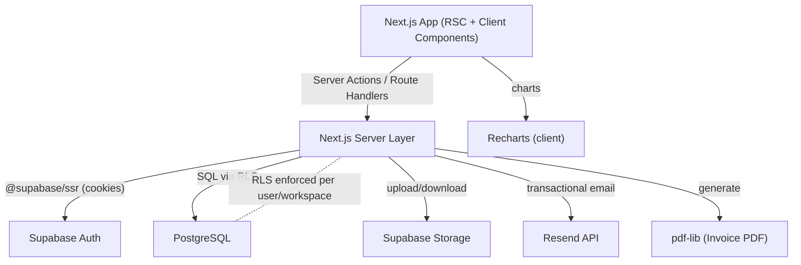
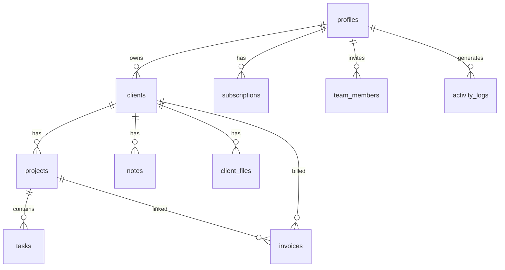

# Product Requirements Document & Statement of Work

## Studioflow — Agency CRM (SaaS)

| Meta | Value |
|------|-------|
| **Document** | PRD + SoW (v1.0) |
| **Date** | June 18, 2026 |
| **Project Type** | Greenfield, full-stack SaaS (portfolio-grade) |
| **Status** | Phase 0 complete — awaiting Phase 1 |
| **Brand Name** | Studioflow (working title) |

---

## 1. Executive Summary

**Studioflow** is a commercial SaaS web application that enables small agencies (2–10 people) and freelancers to manage clients, projects, tasks, invoices, team members, files, subscriptions, and business activity from a single dashboard.

The product must feel like a real commercial SaaS — not a tutorial or school project — with premium UI (glassmorphism, indigo accent, light/dark mode), strict security (RLS), role-based access control, and a complete feature set as defined below.

---

## 2. Goals & Non-Goals

### Goals

- Centralized dashboard for the full agency workflow (clients → projects → tasks → invoices)
- Multi-user workspace: Owner + invited team members with real auth accounts
- Production-ready structure, type-safe code, full RLS policies from day one
- Premium UX: loading/empty/error states, toasts, confirm dialogs, full responsiveness
- Demo monetization: Free / Pro / Agency plans with strict limits and demo billing

### Non-Goals (Out of Scope for v1)

- Real payment integration (Stripe, etc.) — billing is demo-only
- Automated tests (unit/e2e) — skipped in v1
- Native mobile app — responsive web only
- Multi-currency — USD only in v1
- Invoice line items — single amount field only in v1
- Advanced reporting beyond specified dashboard/revenue pages

---

## 3. Target Users & Personas

| Persona | Description |
|---------|-------------|
| **Primary user** | Small agency with a team (2–10 people) |
| **Owner** | Founder/admin — full access, manages subscription, invites team |
| **Manager** | Manages clients, projects, and tasks |
| **Member** | Works on assigned tasks, updates own progress |

---

## 4. Confirmed Decisions (Discovery Q&A)

| Topic | Decision |
|-------|----------|
| Primary user | Small agency with team (2–10) |
| Design style | Premium SaaS, glassmorphism |
| Color scheme | Indigo / purple accent |
| Dark mode | Light + dark with toggle |
| UI language | English |
| Component library | shadcn/ui (Radix + Tailwind) |
| Next.js | Latest App Router + Server Actions |
| Forms | react-hook-form + Zod |
| Toasts | Sonner |
| Deployment | Vercel + Supabase Cloud |
| Supabase setup | Existing project — credentials in `.env.local` |
| Team model | Owner workspace; members see owner's data |
| Team auth | Real accounts via email invitation |
| RLS | Full policies on all tables from start |
| Activity logs | Generated from application code (Server Actions) |
| Currency | USD ($) |
| Plan limits | Strictly enforced with upsell message |
| Kanban scope | Projects (Planning → In Progress → Review → Completed) |
| Drag & drop | @dnd-kit + fallback status controls |
| Email | Real Resend API key |
| PDF design | Professional branded template |
| Invoice items | Single amount field |
| Seed data | SQL script + TypeScript seed script |
| Avatars | Supabase Storage upload |
| Search/filter | Server-side (Supabase queries, URL params) |
| RBAC | Strict — UI hides + server validates permissions |
| Build order | Phase by phase: setup → auth → DB → modules → dashboard → extras |
| MVP priority | Auth + Clients + Projects + Tasks + Dashboard |
| Testing | None in v1 |
| Landing page | Yes — marketing + pricing + login |
| Credentials | User fills `.env.local` from `.env.example` |
| Brand name | Studioflow (AI-suggested, user approved) |
| Package manager | npm |
| Dashboard scope | Full KPI + charts + widgets from start |

---

## 5. Tech Stack

### Frontend

- Next.js (App Router)
- TypeScript
- Tailwind CSS v4
- shadcn/ui
- react-hook-form + Zod
- Sonner (toasts)
- Recharts (charts)
- @dnd-kit (Kanban drag & drop)
- next-themes (dark mode)
- lucide-react (icons)

### Backend

- Next.js Server Actions / Route Handlers
- Supabase (`@supabase/ssr`, `@supabase/supabase-js`)

### Database & Storage

- PostgreSQL (Supabase)
- Supabase Storage (avatars, client files)

### Authentication

- Supabase Auth (email/password, password reset)

### Email

- Resend (transactional emails)

### PDF

- pdf-lib (invoice export)

### Deployment

- Vercel (frontend/backend)
- Supabase Cloud (database, auth, storage)

---

## 6. Design & Branding

- **Style:** Premium SaaS, glassmorphism (frosted panels, blur, subtle shadows/gradients)
- **Accent:** Indigo / purple
- **Themes:** Light + dark with system preference support
- **Language:** English
- **Currency:** USD ($)
- **Brand:** Studioflow + text logo

### Reusable Components

Button, Card, Modal/Dialog, Table, Badge, EmptyState, StatCard, ChartCard, ConfirmDialog, FormField, PageHeader, LoadingSpinner, ThemeToggle, and shadcn/ui primitives.

---

## 7. Architecture



### Multi-Tenancy Model

- Owner creates and owns the workspace
- Team members are invited via email and create real Supabase Auth accounts
- Team members access the owner's data (scoped via `owner_id` / workspace)
- RLS ensures users only access data within their workspace

---

## 8. Folder Structure

```
src/
├── app/
│   ├── (auth)/          # login, register, reset-password
│   ├── (dashboard)/     # protected app routes
│   ├── (marketing)/     # landing, pricing (optional grouping)
│   ├── layout.tsx
│   ├── page.tsx         # marketing landing
│   └── globals.css
├── actions/             # Server Actions
├── components/
│   ├── ui/              # shadcn/ui primitives
│   ├── layout/          # sidebar, header, theme toggle
│   ├── shared/          # empty-state, stat-card, confirm-dialog, etc.
│   ├── dashboard/       # dashboard-specific widgets
│   └── providers/       # theme, app providers
├── hooks/
├── lib/
│   ├── supabase/        # client, server, middleware
│   ├── email/           # Resend service + templates
│   ├── pdf/             # invoice PDF generation
│   ├── validations/     # Zod schemas
│   ├── constants/       # plans, roles, statuses
│   └── utils.ts
├── types/
└── middleware.ts
```

---

## 9. Database Design

### Enums

| Enum | Values |
|------|--------|
| `role` | Owner, Manager, Member |
| `plan` | Free, Pro, Agency |
| `subscription_status` | Active, Cancelled |
| `client_status` | Lead, Active, Inactive |
| `project_status` | Planning, In Progress, Review, Completed |
| `task_priority` | Low, Medium, High |
| `task_status` | Todo, Doing, Done |
| `invoice_status` | Pending, Paid, Overdue |

### Tables

| Table | Key Fields |
|-------|------------|
| `profiles` | id (= auth.uid), email, full_name, avatar_url, role, created_at |
| `subscriptions` | id, user_id, plan, status, created_at |
| `clients` | id, user_id, name, company, email, phone, status, notes, created_at |
| `projects` | id, client_id, user_id, name, description, budget, deadline, status, created_at |
| `tasks` | id, project_id, assigned_user, title, description, due_date, priority, status, created_at |
| `invoices` | id, client_id, project_id, invoice_number, amount, due_date, status, created_at |
| `notes` | id, client_id, user_id, content, created_at |
| `team_members` | id, owner_id, email, role, created_at |
| `client_files` | id, client_id, file_name, file_url, uploaded_at |
| `activity_logs` | id, user_id, action, entity_type, entity_id, created_at |

### Entity Relationships



---

## 10. Security & RLS

- **Full RLS policies from start** on all tables listed above
- Users access only their workspace data (owner_id / user_id scoping)
- Auth via `@supabase/ssr` cookie-based sessions
- Storage bucket policies for avatars and client files
- **Strict RBAC:** UI hides unauthorized actions + server-side permission checks on every mutation

### RBAC Matrix

| Action | Owner | Manager | Member |
|--------|:-----:|:-------:|:------:|
| Clients / Projects / Tasks CRUD | ✓ | ✓ | — |
| View assigned tasks | ✓ | ✓ | ✓ |
| Update own task progress | ✓ | ✓ | ✓ |
| Invoices, Billing, Team, Settings | ✓ | — | — |

---

## 11. Functional Requirements

### 11.1 Authentication

- Sign Up, Sign In, Logout, Password Reset
- Protected routes — redirect unauthenticated users to login
- Post-registration flow:
  1. Create user profile (role: Owner)
  2. Create default Free subscription
  3. Send Welcome email via Resend

### 11.2 Clients

- CRUD + server-side search + filter by status
- Statuses: Lead, Active, Inactive

### 11.3 Projects

- CRUD + search + filter by status
- Statuses: Planning, In Progress, Review, Completed
- Linked to client

### 11.4 Tasks

- CRUD + search + filter
- Assign users, set priority (Low/Medium/High), status (Todo/Doing/Done)
- Linked to project

### 11.5 Invoices

- CRUD + search + filter
- Statuses: Pending, Paid, Overdue
- Single amount field
- PDF export (Pro+ plans)

### 11.6 Notes

- Create/read notes linked to clients

### 11.7 Client Files

- Upload to Supabase Storage: contracts, briefs, PDFs, documents
- Metadata in `client_files` table

### 11.8 Team Members

- Invite via email (real Supabase Auth accounts)
- Assign roles (Owner/Manager/Member)
- Manage team (Agency plan)

### 11.9 Activity Logs

Generated from Server Actions. Examples:

- Client Created / Updated / Deleted
- Project Created / Updated / Completed
- Task Created / Completed
- Invoice Created / Paid

### 11.10 Kanban Board

- Columns: Planning → In Progress → Review → Completed
- Drag & drop via @dnd-kit
- Fallback status update controls

### 11.11 Client Details Page

- Client information
- Associated projects, invoices, notes, uploaded files

### 11.12 Dashboard

**KPI Cards:**

- Active Clients
- Active Projects
- Monthly Revenue
- Completed Tasks

**Charts (Recharts):**

- Revenue by Month
- Revenue Trend

**Widgets:**

- Upcoming Deadlines
- Recent Projects
- Tasks Due Today
- Recent Activity

**Metrics:**

- Task Completion Rate
- Most Profitable Clients

### 11.13 Revenue Page

- Total Revenue, Monthly Revenue, Pending Revenue, Paid Invoices
- Charts: Monthly Revenue, Revenue Trends
- Table: Most Profitable Clients

### 11.14 Pricing Page

| Plan | Features |
|------|----------|
| **Free** | Up to 5 clients, up to 3 projects |
| **Pro** | Unlimited clients & projects, PDF Export |
| **Agency** | Everything in Pro + Team Members + Advanced Features |

### 11.15 Billing Page (Demo)

- Current plan, subscription status, created date
- Switch plans for demonstration (no real payment)

### 11.16 Plan Limits (Strictly Enforced)

- Free: max 5 clients, max 3 projects — block creation + upsell message
- Pro: unlimited + PDF export
- Agency: everything in Pro + team members

### 11.17 Settings Page

- Full name, email, avatar (Supabase Storage), password
- Logout option

### 11.18 PDF Export

Professional invoice PDF containing:

- Invoice Number, Client, Project, Amount, Due Date, Status
- Brand logo and colors

---

## 12. Email System (Resend)

Reusable email service with templates:

| # | Email | Trigger |
|---|-------|---------|
| 1 | Welcome | After registration |
| 2 | Task Assigned | When task is assigned to user |
| 3 | Project Completed | When project status → Completed |
| 4 | Invoice Created | When invoice is created |
| 5 | Invoice Overdue | When invoice becomes overdue |

---

## 13. Non-Functional Requirements

- Fully responsive (mobile, tablet, desktop)
- Type-safe TypeScript throughout
- Form validation with Zod
- Error handling on all server actions
- Loading states on async operations
- Empty states when no data
- Toast notifications (Sonner)
- Confirm dialogs before delete actions
- Clean folder structure with separation of concerns
- Environment variables documented in `.env.example`

---

## 14. Seed Data

Delivered as SQL seed script + TypeScript seed script:

| Entity | Count |
|--------|-------|
| Clients | 5 |
| Projects | 6 |
| Tasks | 12 |
| Invoices | 8 |
| Notes | Multiple |
| Activity Logs | Multiple |
| Team Members | Sample set |
| Client Files | Sample set |

---

## 15. Assumptions & Dependencies

- User has an existing Supabase project and will provide credentials via `.env.local`
- User has a real Resend API key and verified sender domain/email
- Deployment target: Vercel + Supabase Cloud
- No automated tests in v1

---

## 16. Statement of Work — Delivery Phases

### Phase 0 — Setup ✅

- Next.js + TypeScript + Tailwind + shadcn/ui
- Project folder structure
- Supabase clients (`@supabase/ssr`)
- `.env.example`, theme (light/dark), base UI kit, Sonner
- Marketing landing page shell
- This PRD document

### Phase 1 — Auth & Profiles

- Sign up / sign in / logout / password reset
- Route protection (middleware)
- Post-signup hook: profile + Free subscription + Welcome email

### Phase 2 — Database & RLS

- All tables, enums, indexes
- Full RLS policies
- Storage buckets (avatars, client-files)
- Seed data (SQL + TypeScript)

### Phase 3 — Core Modules (MVP)

- Clients, Projects, Tasks — full CRUD + search + filter + assign
- Activity logging on mutations
- Plan limit enforcement

### Phase 4 — Dashboard & Kanban

- KPI cards, charts, widgets, metrics
- Project Kanban board with @dnd-kit

### Phase 5 — Finances

- Invoices CRUD + PDF export
- Revenue page
- Pricing + demo Billing pages

### Phase 6 — Collaboration & Files

- Notes, Client Files (Storage upload)
- Team invite + role management
- Client Details page

### Phase 7 — Email & RBAC Polish

- All 5 Resend email templates wired to triggers
- Strict RBAC enforcement (UI + server)
- Final polish: empty/error/loading states, responsiveness
- Deploy preparation

---

## 17. Acceptance Criteria

- [ ] Unauthenticated users are redirected to login
- [ ] Registration creates profile + Free subscription + sends Welcome email
- [ ] RLS prevents access to other users' data (verified per table)
- [ ] All modules have CRUD + search/filter + appropriate states
- [ ] Plan limits block over-limit creation with upsell message
- [ ] RBAC hides and server-side rejects unauthorized actions
- [ ] Dashboard displays all KPI/charts/widgets/metrics with real DB data
- [ ] Invoice PDF generates with all required fields
- [ ] All 5 emails send on correct triggers
- [ ] Seed data populates app with realistic content
- [ ] App is deployable to Vercel

---

## 18. Environment Variables

See [`.env.example`](.env.example):

```
NEXT_PUBLIC_SUPABASE_URL=
NEXT_PUBLIC_SUPABASE_ANON_KEY=
SUPABASE_SERVICE_ROLE_KEY=
RESEND_API_KEY=
RESEND_FROM_EMAIL=
NEXT_PUBLIC_APP_URL=
```

---

## 19. Open Items

- Final brand name confirmation (working title: **Studioflow**)
- Supabase project credentials (user provides via `.env.local`)
- Resend API key and verified sender email

---

*Document generated from project discovery session — June 18, 2026.*
