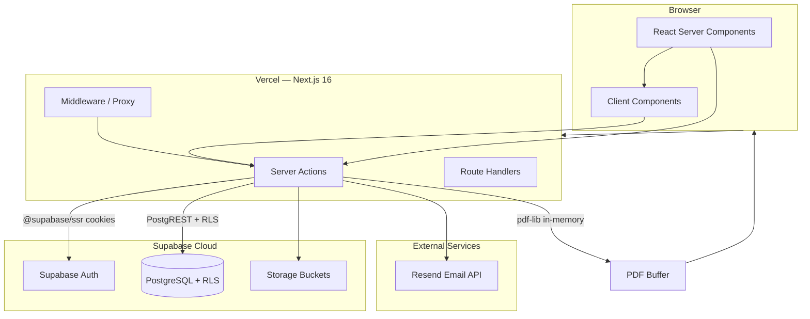
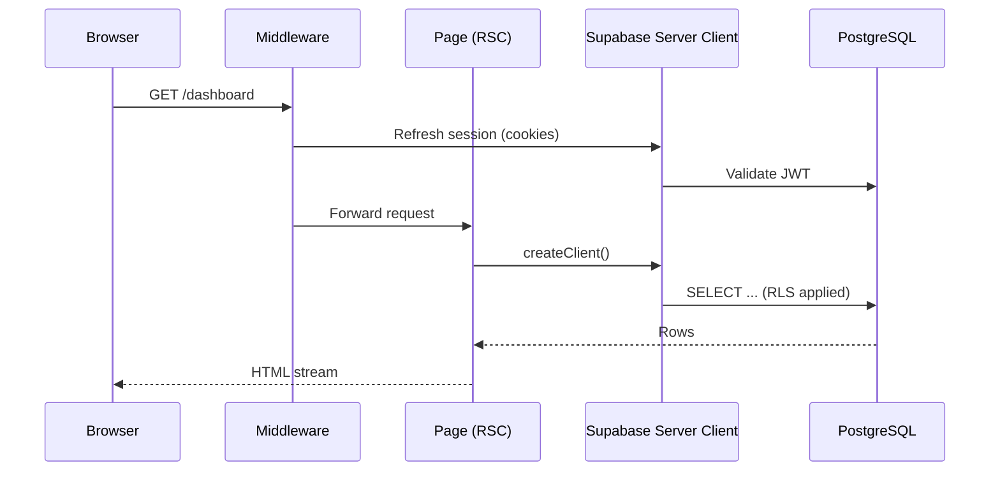
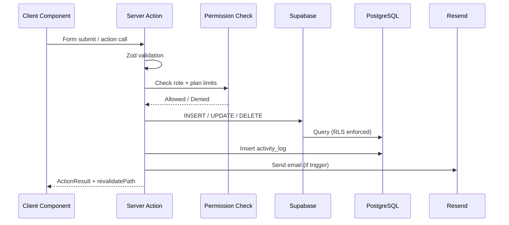
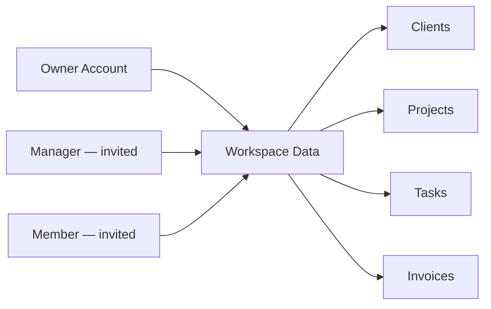

# Tech — Architecture & Technical Implementation

## Studioflow — Agency CRM

| Meta | Value |
|------|-------|
| **Document** | Technical Architecture (v1.0) |
| **Date** | June 18, 2026 |
| **Related** | [PRD.md](./PRD.md) · [DB.md](./DB.md) |
| **Current Phase** | Phase 0 + Phase 2 (Database) complete — Phase 1 (Auth) next |

---

## 1. Overview

Studioflow is a full-stack SaaS application built as a **monolithic Next.js app** with a **Supabase backend** (PostgreSQL, Auth, Storage). Business logic runs primarily through **Server Actions** and **Route Handlers**, with the browser consuming React Server Components (RSC) and client components where interactivity is required.

The architecture prioritizes:

- **Type safety** end-to-end (TypeScript + Zod + generated DB types)
- **Security by default** (RLS on all tables, server-side RBAC checks)
- **Workspace isolation** (owner-centric multi-tenancy)
- **Production patterns** (cookie-based auth, structured error handling, reusable UI)

---

## 2. Current Project State (Phase 0)

### 2.1 Installed & Configured

| Category | Package / Tool | Version | Status |
|----------|----------------|---------|--------|
| Framework | `next` | 16.2.9 | ✅ Installed |
| UI Library | `react` / `react-dom` | 19.2.4 | ✅ Installed |
| Language | `typescript` | ^5 | ✅ Installed |
| Styling | `tailwindcss` | ^4 | ✅ Installed |
| PostCSS | `@tailwindcss/postcss` | ^4 | ✅ Installed |
| UI Components | `shadcn` + `@base-ui/react` | 4.11.0 / ^1.6.0 | ✅ Initialized |
| Icons | `lucide-react` | ^1.21.0 | ✅ Installed |
| Utilities | `clsx`, `tailwind-merge`, `class-variance-authority` | latest | ✅ Installed |
| Animation | `tw-animate-css` | ^1.4.0 | ✅ Installed |
| Theme | `next-themes` | ^0.4.6 | ✅ Wired in providers |
| Toasts | `sonner` | ^2.0.7 | ✅ Wired via shadcn Toaster |
| Forms | `react-hook-form` | ^7.79.0 | ✅ Installed |
| Validation | `zod` | ^4.4.3 | ✅ Installed |
| Form Resolvers | `@hookform/resolvers` | ^5.4.0 | ✅ Installed |
| Database Client | `@supabase/supabase-js` | ^2.108.2 | ✅ Installed |
| SSR Auth | `@supabase/ssr` | ^0.12.0 | ✅ Client/server/middleware setup |
| Charts | `recharts` | ^3.8.1 | ✅ Installed (not yet used) |
| Drag & Drop | `@dnd-kit/core`, `sortable`, `utilities` | latest | ✅ Installed (not yet used) |
| Email | `resend` | ^6.14.0 | ✅ Installed (placeholder module) |
| PDF | `pdf-lib` | ^1.17.1 | ✅ Installed (placeholder module) |
| Linting | `eslint` + `eslint-config-next` | ^9 / 16.2.9 | ✅ Installed |
| Package Manager | npm | — | ✅ In use |

### 2.2 shadcn/ui Components (Installed)

Located in `src/components/ui/`:

`button`, `card`, `input`, `label`, `dialog`, `dropdown-menu`, `avatar`, `badge`, `skeleton`, `separator`, `sheet`, `select`, `textarea`, `tabs`, `sonner`

Style: **base-nova**, icon library: **lucide**, CSS variables enabled.

### 2.3 Custom Components (Implemented)

| Component | Path | Purpose |
|-----------|------|---------|
| `AppProviders` | `src/components/providers/app-providers.tsx` | Theme + toast wrapper |
| `ThemeProvider` | `src/components/providers/theme-provider.tsx` | next-themes integration |
| `ThemeToggle` | `src/components/layout/theme-toggle.tsx` | Light/dark switch |
| `EmptyState` | `src/components/shared/empty-state.tsx` | No-data UI |
| `StatCard` | `src/components/shared/stat-card.tsx` | Dashboard KPI cards |
| `PageHeader` | `src/components/shared/page-header.tsx` | Page title + actions |
| `ConfirmDialog` | `src/components/shared/confirm-dialog.tsx` | Delete confirmations |
| `LoadingSpinner` | `src/components/shared/loading-spinner.tsx` | Async loading UI |

### 2.4 Infrastructure Files (Implemented)

| File | Purpose |
|------|---------|
| `src/lib/supabase/client.ts` | Browser Supabase client |
| `src/lib/supabase/server.ts` | Server Component / Action client |
| `src/lib/supabase/middleware.ts` | Session refresh helper |
| `src/middleware.ts` | Auth session middleware |
| `src/lib/constants/plans.ts` | Subscription plan limits |
| `src/lib/constants/roles.ts` | RBAC permissions map |
| `src/lib/constants/app.ts` | App name, statuses, currency |
| `src/types/index.ts` | Application TypeScript types |
| `.env.example` | Environment variable template |

### 2.5 Placeholder Modules (Installed deps, not yet implemented)

| Module | Path | Planned Phase |
|--------|------|---------------|
| Server Actions | `src/actions/index.ts` | Phase 1+ |
| Email service | `src/lib/email/index.ts` | Phase 7 |
| PDF generation | `src/lib/pdf/index.ts` | Phase 5 |
| Zod schemas | `src/lib/validations/index.ts` | Phase 3+ |

### 2.6 Routes (Current)

| Route | Status |
|-------|--------|
| `/` | ✅ Marketing landing page |
| `/login`, `/register`, `/pricing` | 🔲 Linked but not yet created |
| Dashboard routes | 🔲 Phase 1–4 |

---

## 3. System Architecture



### 3.1 Rendering Strategy

| Layer | Technology | Usage |
|-------|------------|-------|
| **Server Components** | Next.js RSC | Data fetching, layouts, static content, initial page render |
| **Client Components** | `"use client"` | Forms, modals, theme toggle, Kanban DnD, Recharts, toasts |
| **Server Actions** | `"use server"` | All mutations (CRUD), auth flows, file upload metadata, emails |
| **Route Handlers** | `app/api/**/route.ts` | PDF download, webhooks (if needed), auth callbacks |

**Default rule:** fetch on the server, mutate via Server Actions, keep client boundaries minimal.

### 3.2 Request Flow (Authenticated Page)



### 3.3 Mutation Flow (Server Action)



---

## 4. Technology Stack (Detailed)

### 4.1 Frontend

| Concern | Choice | Rationale |
|---------|--------|-----------|
| Framework | Next.js 16 App Router | RSC, Server Actions, file-based routing, Vercel deploy |
| Language | TypeScript (strict) | Type safety across app and DB types |
| Styling | Tailwind CSS v4 | Utility-first, design tokens via CSS variables |
| Components | shadcn/ui (Base UI) | Accessible, customizable, no vendor lock-in |
| Forms | react-hook-form + Zod | Performant forms + shared validation schemas |
| Icons | lucide-react | Consistent icon set, tree-shakeable |
| Charts | Recharts | Composable React charts for dashboard/revenue |
| DnD | @dnd-kit | Accessible Kanban drag-and-drop |
| Theming | next-themes | System/light/dark with class strategy |
| Notifications | Sonner | Toast feedback for success/error states |

### 4.2 Backend (Within Next.js)

| Concern | Choice | Rationale |
|---------|--------|-----------|
| API layer | Server Actions (primary) | Colocated with UI, type-safe, no REST boilerplate |
| Secondary API | Route Handlers | Binary responses (PDF), external callbacks |
| Validation | Zod schemas in `lib/validations/` | Shared client + server validation |
| Auth session | `@supabase/ssr` | Cookie-based sessions compatible with RSC |

### 4.3 Supabase Services

| Service | Usage |
|---------|-------|
| **Auth** | Email/password signup, login, password reset, invite flow |
| **PostgreSQL** | All relational data with RLS |
| **Storage** | `avatars` bucket (profile images), `client-files` bucket (documents) |
| **Realtime** | Not used in v1 |

### 4.4 External Services

| Service | Usage | Integration Point |
|---------|-------|-------------------|
| **Resend** | Transactional emails (5 templates) | `src/lib/email/` called from Server Actions |
| **Vercel** | Hosting, edge middleware, env vars | Deploy target |

---

## 5. Multi-Tenancy & Workspace Model

Studioflow uses an **owner-centric workspace** model:



### 5.1 Workspace Resolution

Every authenticated user resolves to a **workspace owner ID**:

| User type | `profiles.owner_id` | Effective workspace |
|-----------|---------------------|---------------------|
| Owner (registrant) | `NULL` | Own `profiles.id` |
| Team member | Points to owner's UUID | Owner's `profiles.id` |

All tenant-scoped tables store `user_id` referencing the **workspace owner**, not the acting team member. RLS policies use a helper function `get_workspace_owner_id(auth.uid())` to scope queries.

### 5.2 Team Invitation Flow (Planned — Phase 6)

1. Owner invites email via Server Action → row in `team_members`
2. Supabase Auth sends invite / magic link
3. Invitee registers → profile created with `owner_id` set and role from invitation
4. `team_members.user_id` linked on acceptance

---

## 6. Authentication & Authorization

### 6.1 Auth Implementation

| Feature | Implementation |
|---------|----------------|
| Sign up | Server Action → `supabase.auth.signUp()` → create profile + subscription |
| Sign in | Server Action → `supabase.auth.signInWithPassword()` |
| Logout | Server Action → `supabase.auth.signOut()` |
| Password reset | Supabase Auth reset email flow |
| Session refresh | `src/middleware.ts` → `updateSession()` on each request |
| Protected routes | Middleware redirect unauthenticated users to `/login` |

### 6.2 Supabase Client Variants

```typescript
// Browser (Client Components)
import { createClient } from "@/lib/supabase/client";

// Server (RSC, Server Actions)
import { createClient } from "@/lib/supabase/server";

// Middleware (session refresh)
import { updateSession } from "@/lib/supabase/middleware";
```

### 6.3 RBAC (Role-Based Access Control)

Permissions defined in `src/lib/constants/roles.ts` as `ROLE_PERMISSIONS`.

| Check location | Responsibility |
|----------------|----------------|
| **UI** | Hide buttons, nav items, routes based on role |
| **Server Actions** | Reject unauthorized mutations before DB call |
| **RLS** | Last line of defense — DB-level row access |

Roles: **Owner**, **Manager**, **Member** (see PRD RBAC matrix).

### 6.4 Plan Limits

Enforced in Server Actions before insert operations, using `PLAN_LIMITS` from `src/lib/constants/plans.ts`:

- **Free:** max 5 clients, max 3 projects
- **Pro:** unlimited + PDF export
- **Agency:** Pro features + team members

---

## 7. Data Access Patterns

### 7.1 Read (Server Components)

```typescript
// Pattern: fetch in page.tsx or dedicated lib query function
const supabase = await createClient();
const { data, error } = await supabase
  .from("clients")
  .select("*")
  .order("created_at", { ascending: false });
```

Search/filter via URL search params → passed to Supabase `.ilike()`, `.eq()`, `.or()`.

### 7.2 Write (Server Actions)

All mutations follow this pattern:

1. Parse input with Zod
2. Get authenticated user + workspace owner ID
3. Check RBAC permission
4. Check plan limits (if create)
5. Execute Supabase mutation
6. Log to `activity_logs`
7. Trigger email (if applicable)
8. `revalidatePath()` affected routes
9. Return `ActionResult<T>`

### 7.3 Activity Logging

Generated **in application code** (not DB triggers). Each Server Action calls a shared helper:

```typescript
await logActivity({
  userId: actorId,
  action: "Client Created",
  entityType: "client",
  entityId: client.id,
});
```

### 7.4 File Uploads

1. Client uploads to Supabase Storage via signed URL or direct upload
2. Server Action stores metadata in `client_files` table
3. Storage RLS restricts access to workspace members

---

## 8. Module Integration

### 8.1 Email (Resend)

| Email | Trigger | Phase |
|-------|---------|-------|
| Welcome | After registration | Phase 1 |
| Task Assigned | Task `assigned_user` set | Phase 7 |
| Project Completed | Status → Completed | Phase 7 |
| Invoice Created | New invoice | Phase 7 |
| Invoice Overdue | Status → Overdue (cron or check) | Phase 7 |

Service structure:

```
src/lib/email/
├── index.ts          # sendEmail() wrapper
├── client.ts         # Resend instance
└── templates/
    ├── welcome.tsx
    ├── task-assigned.tsx
    └── ...
```

Uses `RESEND_API_KEY` and `RESEND_FROM_EMAIL` from environment.

### 8.2 PDF Export (pdf-lib)

- Generated server-side in Route Handler or Server Action
- Returns `application/pdf` buffer for download
- Gated by Pro+ plan (`PLAN_LIMITS[plan].pdfExport`)
- Template includes: invoice number, client, project, amount, due date, status, branding

### 8.3 Dashboard Charts (Recharts)

- Data aggregated in Server Component or dedicated query functions
- Passed as props to client chart components
- Charts: Revenue by Month, Revenue Trend, Task Completion Rate

### 8.4 Kanban Board (@dnd-kit)

- Client component with project cards grouped by `status`
- Optimistic UI on drag → Server Action updates `projects.status`
- Fallback: status dropdown on each card

---

## 9. Folder Structure

### 9.1 Current (Phase 0)

```
src/
├── app/
│   ├── layout.tsx              # Root layout + providers
│   ├── page.tsx                # Marketing landing
│   └── globals.css             # Tailwind + theme tokens + glass utilities
├── actions/
│   └── index.ts                # (placeholder)
├── components/
│   ├── ui/                     # shadcn/ui primitives (15 components)
│   ├── layout/                 # theme-toggle
│   ├── shared/                 # empty-state, stat-card, etc.
│   └── providers/              # theme + app providers
├── hooks/
│   └── use-mounted.ts
├── lib/
│   ├── supabase/               # client, server, middleware
│   ├── email/                  # (placeholder)
│   ├── pdf/                    # (placeholder)
│   ├── validations/            # (placeholder)
│   ├── constants/              # plans, roles, app
│   └── utils.ts                # cn() helper
├── types/
│   ├── index.ts                # Application types
│   └── database.ts             # (placeholder for generated types)
└── middleware.ts
```

### 9.2 Planned (Phases 1–7)

```
src/app/
├── (auth)/
│   ├── login/page.tsx
│   ├── register/page.tsx
│   └── reset-password/page.tsx
├── (dashboard)/
│   ├── layout.tsx              # Sidebar + header shell
│   ├── dashboard/page.tsx
│   ├── clients/
│   ├── projects/
│   ├── tasks/
│   ├── invoices/
│   ├── kanban/page.tsx
│   ├── revenue/page.tsx
│   ├── team/page.tsx
│   ├── billing/page.tsx
│   └── settings/page.tsx
├── (marketing)/
│   └── pricing/page.tsx
└── api/
    └── invoices/[id]/pdf/route.ts

supabase/
├── migrations/                 # SQL migrations
└── seed.sql                    # Seed data

scripts/
└── seed.ts                     # TypeScript seed runner
```

---

## 10. Environment Variables

| Variable | Scope | Required | Purpose |
|----------|-------|----------|---------|
| `NEXT_PUBLIC_SUPABASE_URL` | Public | Yes | Supabase project URL |
| `NEXT_PUBLIC_SUPABASE_ANON_KEY` | Public | Yes | Supabase anon key (RLS-protected) |
| `SUPABASE_SERVICE_ROLE_KEY` | Server only | Yes | Admin ops (seeding, invites) |
| `RESEND_API_KEY` | Server only | Yes | Email sending |
| `RESEND_FROM_EMAIL` | Server only | Yes | Sender address |
| `NEXT_PUBLIC_APP_URL` | Public | Yes | App URL for email links |

Template: [`.env.example`](../.env.example)

---

## 11. Deployment

### 11.1 Target Platform

| Component | Platform |
|-----------|----------|
| Next.js app | **Vercel** |
| Database, Auth, Storage | **Supabase Cloud** |
| Email | **Resend** |

### 11.2 Deploy Checklist

1. Create Supabase project → run migrations from `supabase/migrations/`
2. Configure Storage buckets + policies
3. Set all env vars in Vercel project settings
4. Verify Resend domain / sender
5. Deploy via `git push` or Vercel CLI
6. Run seed script against production (optional, demo only)

### 11.3 Build Commands

```bash
npm run dev      # Local development (Turbopack)
npm run build    # Production build
npm run start    # Production server
npm run lint     # ESLint
```

---

## 12. Error Handling & UX Conventions

| Pattern | Implementation |
|---------|----------------|
| Server Action errors | Return `{ success: false, error: string }` |
| Success feedback | Sonner toast via `toast.success()` |
| Delete actions | `ConfirmDialog` before mutation |
| Loading states | `LoadingSpinner` or skeleton components |
| Empty lists | `EmptyState` with contextual CTA |
| Form errors | react-hook-form field errors + Zod messages |

---

## 13. Type Safety Strategy

| Layer | Source |
|-------|--------|
| Application types | `src/types/index.ts` (manual, Phase 0) |
| Database types | Generated via Supabase CLI → `src/types/database.ts` (Phase 2) |
| Form types | Inferred from Zod schemas in `src/lib/validations/` |
| Action results | `ActionResult<T>` union type |

After Phase 2 migration, run:

```bash
npx supabase gen types typescript --project-id <id> > src/types/database.ts
```

---

## 14. Security Considerations

- **RLS enabled** on every public table — no bypass from client
- **Service role key** used only in server-side scripts (seed, admin invite), never exposed to browser
- **RBAC checked server-side** on every mutation — UI hiding is not sufficient
- **File uploads** validated for type/size before Storage upload
- **Input sanitization** via Zod schemas on all Server Action inputs
- **CSRF** handled by Next.js Server Actions same-origin policy

---

## 15. Implementation Roadmap

| Phase | Focus | Key Deliverables |
|-------|-------|------------------|
| **0** ✅ | Setup | Next.js, deps, shadcn, Supabase clients, landing, docs |
| **1** | Auth | Login, register, reset, middleware protection, welcome email |
| **2** | Database | Migrations, RLS, Storage buckets, seed scripts, generated types |
| **3** | Core CRM | Clients, Projects, Tasks CRUD + search + activity logs + plan limits |
| **4** | Dashboard | KPI, charts, widgets, Kanban board |
| **5** | Finances | Invoices, PDF export, Revenue, Pricing, Billing |
| **6** | Collaboration | Notes, files, team invites, client details page |
| **7** | Polish | All emails, strict RBAC, final UX, deploy prep |

---

## 16. Development Workflow

```bash
# 1. Clone & install
npm install

# 2. Configure environment
cp .env.example .env.local
# Fill in Supabase + Resend credentials

# 3. Run locally
npm run dev

# 4. (Phase 2+) Apply migrations
npx supabase db push

# 5. (Phase 2+) Seed demo data
npm run seed
```

---

*Document aligned with [PRD.md](./PRD.md) and verified against installed packages — June 18, 2026.*
